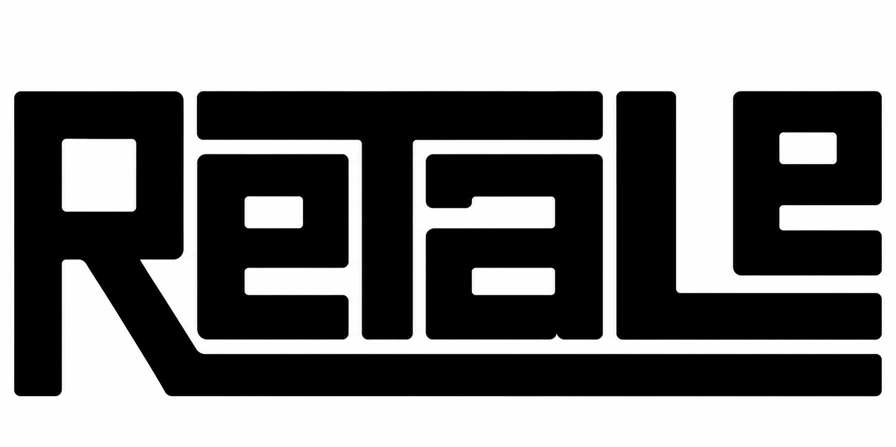
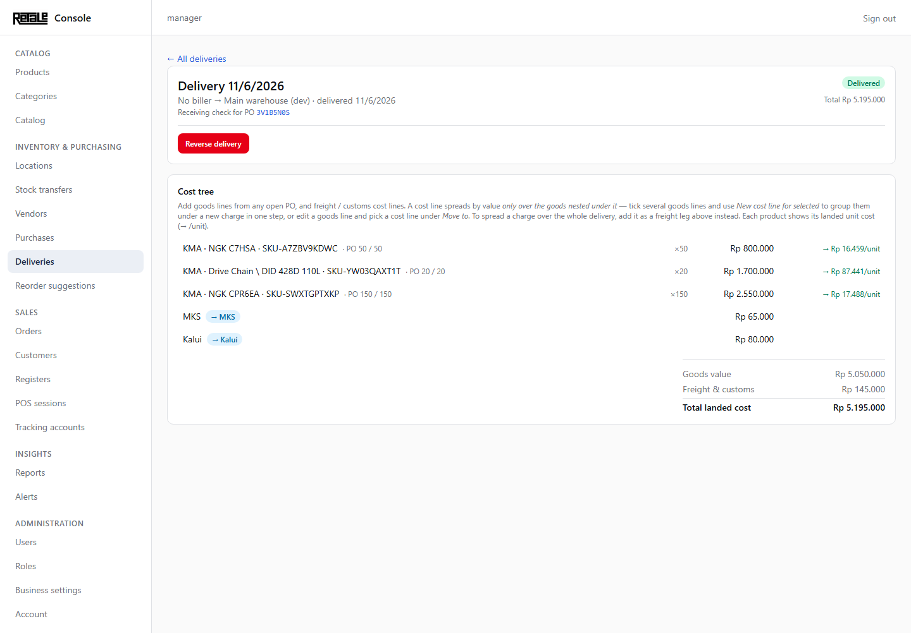

POS and inventory management system for a retail store, served over the local
network. A Bun + TypeScript GraphQL API backs a family of clients: a Flutter
POS register, a SvelteKit back-office console, a product catalog, and two
companion Flutter apps for warehouse receiving and workshop service.

**100% vibe-coded with  Claude.**

## Console highlight: landed-cost deliveries

The most involved workflow lives in the console's **Deliveries** page. A
delivery's *cost tree* combines goods lines pulled from open purchase orders
with freight and customs cost lines, spreads each charge proportionally over
the goods nested under it, and shows the resulting landed unit cost per
product. Delivering moves stock into the target location and records the
landed cost; the whole operation is transactional and reversible.



## Packages

| Package | What it is |
|---|---|
| `packages/api` | GraphQL API — Bun + Elysia + graphql-yoga, Drizzle ORM on MariaDB |
| `packages/console` | Back-office admin web app — SvelteKit + Houdini GraphQL client |
| `packages/catalog` | Product catalog web app — SvelteKit |
| `packages/pos` | POS register — Flutter (Windows/Linux native + web/PWA) |
| `packages/stockeeper` | Warehouse receiving & stock reconcile — Flutter (Android) |
| `packages/workshop` | Offline workshop-service job sheets that submit paid sales — Flutter |
| `packages/shared` | Shared TypeScript types for api + web packages |

## Quick start

Prerequisites: [Bun](https://bun.sh), Docker (for MariaDB), and the Flutter
SDK if you work on the mobile/desktop apps.

```sh
# 1. Database
docker compose up -d

# 2. Environment
cp .env.example .env        # set JWT_SIGNING_KEY etc.

# 3. Install & migrate
bun install
bun run db:migrate

# 4. Run
bun run dev                 # API → http://localhost:3000 (GraphQL at /graphql)
bun run dev:console         # console → http://localhost:5173

# Flutter apps run from their package dir, e.g. the POS register:
cd packages/pos && flutter run -d windows    # or -d chrome / -d linux
```

The Flutter packages ship `lib/` + `pubspec` only — on first checkout run
`flutter create . --platforms=...` and `flutter pub get` in the package dir
(see each package's README, e.g. [`packages/pos/README.md`](packages/pos/README.md)).

For a working dev login (root users require 2FA), seed a full-permission user:

```sh
bun run dev:seed-user       # creates manager / manager12345
```

Dev data helpers: `bun run dev:seed-products`, `bun run db:seed`.

## Production deployment (LAN)

The whole server stack — MariaDB, API, console, and the POS web/PWA — runs on
one LAN host with Docker Compose, behind a Caddy reverse proxy that terminates
HTTPS with its built-in local CA (TLS is required for the POS PWA's offline
service worker):

```sh
cp .env.prod.example .env.prod      # set HOST_IP + fresh secrets
bun run build:pos-web               # POS web bundle (built on the host, served by Caddy)
docker compose -f docker-compose.prod.yml --env-file .env.prod up -d --build
```

Clients then reach the console at `https://<HOST_IP>`, the API at
`https://<HOST_IP>:8443`, and the POS web app at `https://<HOST_IP>:8081`.
Migrations apply automatically on API start. On a fresh install create the
first (root) user with the one-time `bootstrap` mutation — there is no sign-up
screen. See [`deploy/README.md`](deploy/README.md) for that step, plus client
certificate trust, updates, and backups. The catalog is deployed separately to
Vercel and is not part of this stack.

Migrating from ProDuck? `packages/api/scripts/import-from-produck.ts` is a
one-shot, destructive importer for products and vendors only — see its header
and [`docs/design-decisions.md`](docs/design-decisions.md).

## Development

- **Tests:** `bun test` — requires `TEST_DATABASE_URL` pointing at a separate
  `retale_test` database (suites truncate tables); create it once with
  `bun run test:db:setup`.
- **Migrations:** change the Drizzle schema under `packages/api/src/db/schema`,
  then `bun run db:generate` and `bun run db:migrate`. Do **not** use
  `drizzle-kit migrate` directly — it hangs on Windows + Bun + MariaDB;
  `db:migrate` applies migrations programmatically.
- **GraphQL schema changes:** after editing resolvers/type defs in
  `packages/api/src/schema`, regenerate the console's Houdini client
  (`schema:dump` + Houdini codegen — see the `houdini-sync` skill).
- **Commits:** Conventional Commits (`feat:`, `fix:`, `refactor:`, …) with a
  scope where useful, e.g. `fix: console — …`.

## Docs

- [`docs/design-decisions.md`](docs/design-decisions.md) — locked architecture decisions
- [`docs/produck-api-reference.md`](docs/produck-api-reference.md) — legacy ProDuck API surface, kept for parity checks
- [`docs/future-features.md`](docs/future-features.md) — backlog of ideas
